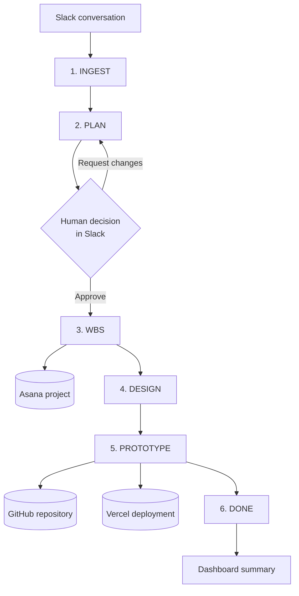
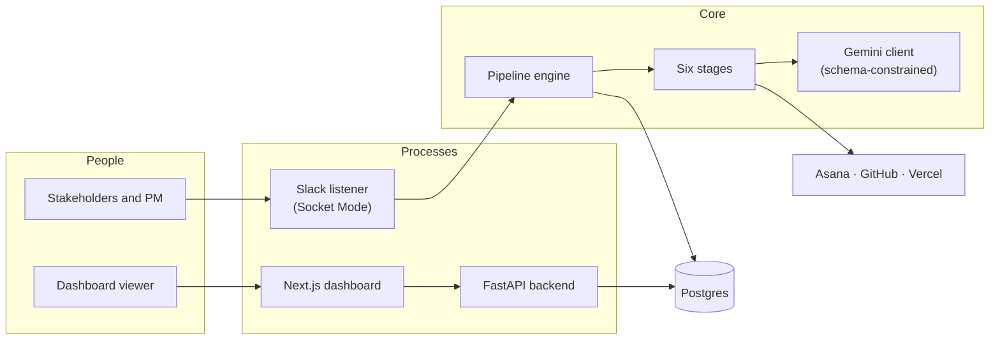
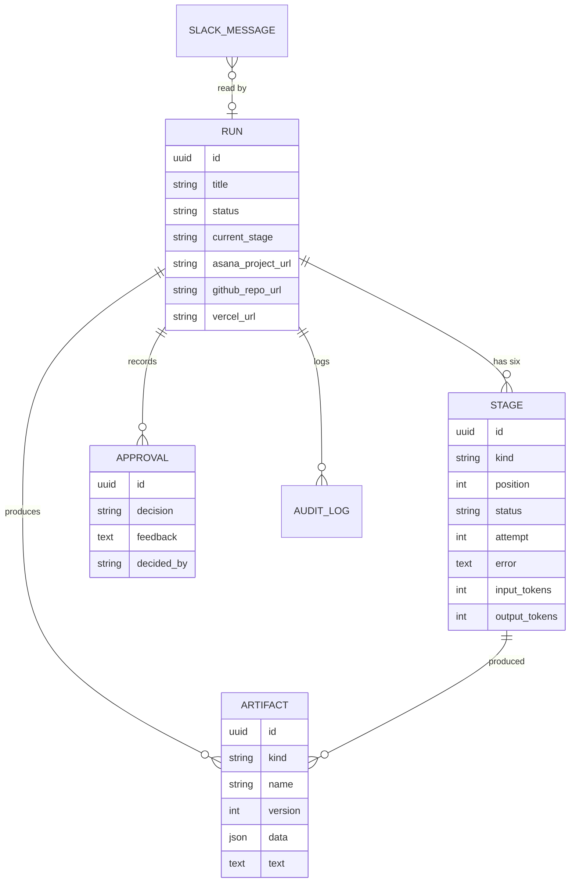
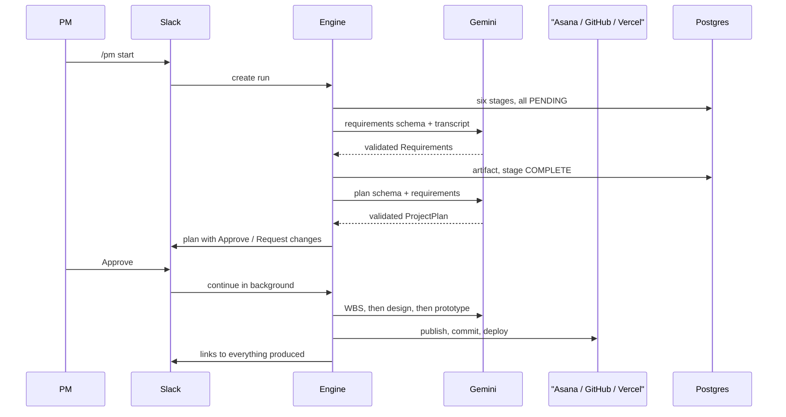

# Architecture

## What the system is

An agentic project manager that reads a stakeholder conversation in Slack and
carries it through to a deployed prototype, stopping once for a human decision.

The central design decision is that **the agent is a linear, resumable state
machine, not a free-roaming agent**. Six stages run in order. Each is a single
model call whose output is constrained to a JSON schema, written to the database
before the next stage starts. There is no tool-calling loop, no planner-executor,
no unbounded iteration.

That is a deliberate trade. A free-roaming agent would be more impressive in the
abstract and considerably worse here: it would be non-deterministic to
demonstrate, hard to debug when a step went wrong, and impossible to describe
precisely in a report. A pipeline can be drawn, tested stage by stage, resumed
after a crash, and explained.

## The pipeline

| Stage | Reads | Produces | External effect |
|---|---|---|---|
| `INGEST` | Captured Slack messages | `Requirements` | — |
| `PLAN` | Requirements | `ProjectPlan` | Approval request in Slack |
| `WBS` | Plan + requirements | `WorkBreakdownStructure` | Asana project, sections, tasks, dependencies |
| `DESIGN` | Plan + requirements | Four Mermaid diagrams | — |
| `PROTOTYPE` | Plan + requirements + design | Static site file map | GitHub repository, Vercel deployment |
| `DONE` | Everything above | Run summary | — |

## Components

Two processes plus one container. The Slack listener is separate from the API
because it holds a long-lived outbound WebSocket, which is a different lifecycle
from serving HTTP requests: reloading the API during development should not drop
the Slack connection, and a crash in one should not take the other down.

## Data model

The database is the source of truth for where a run is, which is what makes the
two properties that matter possible:

* **Resumable.** `advance()` starts from the first stage that is not complete, so
  a crash, a restart, or an exhausted free-tier quota costs the current stage and
  nothing before it.
* **Re-runnable.** Any stage can be reset and run again with feedback, because
  its inputs are artifacts in the database rather than values held by a caller.
  Re-running adds an artifact *version* rather than overwriting, so the history
  of what changed after feedback survives.

## A run, end to end

## Why each piece is the way it is

**Schema-constrained generation.** Every stage constrains output to a JSON schema
derived from a Pydantic model, and validates the response with that same model.
The model is both the contract and the validator, so there is one definition of
each stage's output rather than a schema and a parser that drift apart. This is
the single largest reliability lever in the project: the orchestrator receives
validated objects, never prose it has to interpret.

**Slack Socket Mode, not webhooks.** The app opens an outbound WebSocket, so
there is no public URL, no tunnel to configure, and nothing to expire mid-demo.

**Mermaid as source text.** Diagrams are stored as source, rendered in the
browser by the dashboard and natively by GitHub in the generated README. One
representation that works in three places, and no headless browser anywhere.

**A static prototype, not a generated Next.js app.** Vercel serves static files
with no build step. A generated framework application has to install dependencies
and compile on Vercel's builders, which fails in ways that surface as a red build
minutes into a demo and cannot be fixed from Slack. Removing the build removes
that failure mode rather than mitigating it, and nothing about a low-fidelity
prototype needs a framework.

**GitHub before Vercel.** The prototype is committed before it is deployed, so a
deployment failure leaves the code intact and the run resumable from that point.

**In-process asyncio, not Celery.** Runs are minutes long and low-volume, the
state is already in the database, and a queue would add two services and a day of
setup for nothing this project needs.

**The dashboard is read-only, except for re-running a stage.** Approvals stay in
Slack because the approval *conversation* is the point — a decision made in a
dashboard leaves no trace where the stakeholders are talking.
